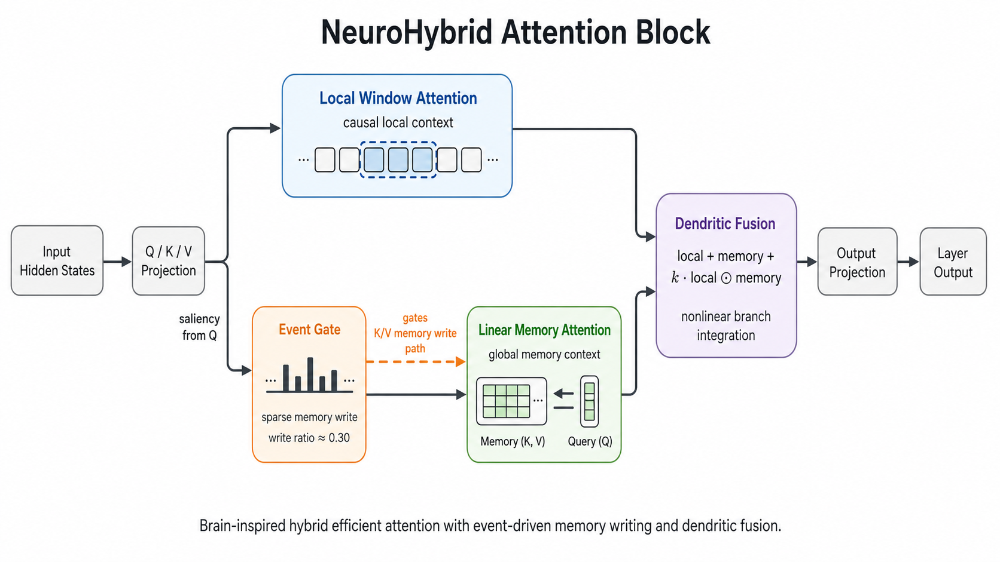
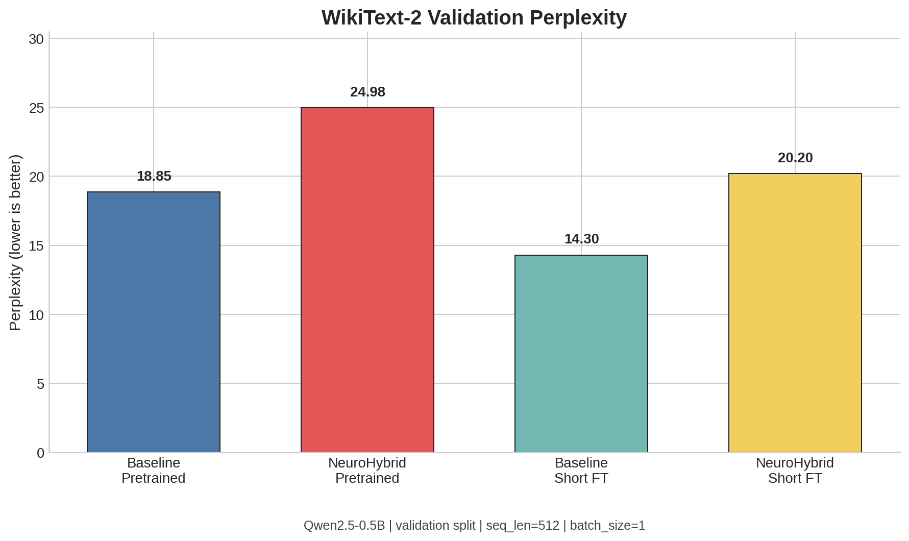
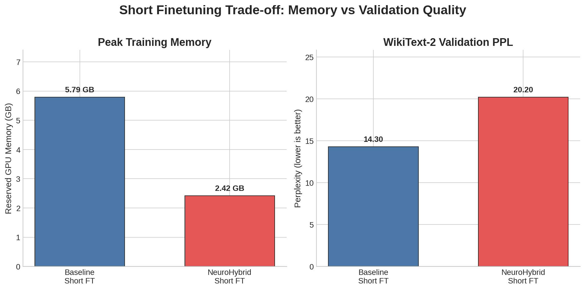

# NeuroHybrid-LLM
A brain-inspired hybrid attention prototype for small language models, featuring event-driven memory writing and dendritic bilinear fusion for efficient long-context modeling.

## Overview

`NeuroHybrid-LLM` is a lightweight research prototype that explores how **brain-inspired mechanisms** can be integrated into the attention backbone of small language models.

The project is built on **Qwen2.5-0.5B** and proposes a hybrid efficient attention module with four components:

- **Local Window Attention** for short-range dependency modeling
- **Linear Memory Attention** for efficient global context aggregation
- **Event Gate** for sparse, event-driven memory writing
- **Dendritic Fusion** for nonlinear integration of local and global branches

---

## Highlights

-  Implemented a **hybrid efficient attention** module on top of **Qwen2.5-0.5B**
-  Supports **event-driven memory writing** with ~**0.30 write ratio** (~70% writes skipped)
-  Supports **dendritic bilinear fusion** for nonlinear branch integration
-  Verified the complete path:  
  **pretrained eval → short finetune → evaluation**
-  Evaluated on a **real language modeling dataset (WikiText-2)**
-  Achieved substantial memory reduction during short finetuning:
  - **Baseline finetune peak memory:** 5.79 GB
  - **NeuroHybrid finetune peak memory:** 2.42 GB
-  Only **7.35M trainable parameters** in the NeuroHybrid short finetuning setup
-  Passed simplified **needle-in-a-haystack** retrieval at **512 / 1024 / 2048** context lengths

---

## Method

### 1) Hybrid Attention

We replace selected attention layers with a hybrid module containing two branches:

- **Local branch:** causal sliding-window attention
- **Global branch:** linear memory attention

A simple baseline fusion is:

\[
y = 0.5\, y_{\text{local}} + 0.5\, y_{\text{linear}}
\]

---

### 2) Event-driven Memory Writing

Inspired by sparse event-driven computation in spiking neural networks, we only allow **salient tokens** to write into the global memory branch.

Let \( s(q) \) be a saliency score computed from query activations, and \( \theta \) an adaptive threshold.  
The event gate is:

\[
g = \text{STE}(\mathbf{1}[s(q) > \theta])
\]

This gate is applied **only to the linear memory write path** (i.e., K/V writing), while the local branch remains unchanged.

---

### 3) Dendritic Bilinear Fusion

Inspired by nonlinear dendritic integration, we fuse local and global outputs via a bilinear interaction:

\[
y = y_{\text{local}} + y_{\text{memory}} + \sigma(\gamma)\, (y_{\text{local}} \odot y_{\text{memory}})
\]

In the current implementation, a `fusion_scale` is used for numerical stability.

---

**Figure 1.** Overview of the proposed NeuroHybrid attention block.  
Input hidden states are projected into Q/K/V, then routed into a **local sliding-window branch** and a **linear memory branch**.  
An **event gate** controls sparse memory writes, and a **dendritic fusion module** integrates the two branches before the output projection.

---

## Main Results on WikiText-2

Validation setting:

- **Dataset:** WikiText-2 validation
- **Sequence length:** 512
- **Batch size:** 1

### Table 1. Main WikiText-2 Results

| Setting | Initialization | Finetuning | Trainable Params | Peak Train Memory | Val Loss ↓ | Val PPL ↓ | Write Ratio |
|---|---|---:|---:|---:|---:|---:|---:|
| Baseline | Pretrained | No | - | - | 2.9367 | **18.8530** | - |
| NeuroHybrid | Pretrained | No | - | - | 3.2179 | 24.9768 | 0.2983 |
| Baseline | Pretrained | 100 steps | Full model | 5.7891 GB | - | **14.2987** | - |
| NeuroHybrid | Pretrained + patch | 100 steps | **7.35M** | **2.4160 GB** | - | 20.1952 | 0.2983 |

### Key Takeaways

- **Direct patching degrades pretrained LM quality**:  
  PPL increases from **18.85** (baseline pretrained) to **24.98** (NeuroHybrid pretrained).
- **Short finetuning recovers part of the loss**:  
  NeuroHybrid improves from **24.98 → 20.20** after 100 steps.
- **Efficiency is the main current strength**:  
  NeuroHybrid short finetuning uses **2.42 GB** peak memory vs **5.79 GB** for baseline finetuning.
- Current results support the claim that NeuroHybrid is a **low-memory, trainable, efficiency-oriented prototype**,  
  but **do not support** claiming stronger language modeling performance than the baseline.

---

**Figure 2.** Validation perplexity comparison on WikiText-2 for four settings:
baseline pretrained, NeuroHybrid pretrained, baseline short finetune, and NeuroHybrid short finetune.

---

**Figure 3.** Peak training memory vs. validation perplexity after short finetuning.  
NeuroHybrid reduces peak memory substantially (**2.42 GB vs. 5.79 GB**) at the cost of worse PPL.

---

## Day-4 Functional Ablation

To verify that each module works correctly and can participate in training, we conducted a small functional ablation with four variants:

- `hybrid`
- `hybrid_gate`
- `hybrid_fusion`
- `hybrid_gate_fusion`

### Table 2. Day-4 Functional Ablation (Sanity Check)

| Variant | 1 layer / 128 loss | 4 layers / 512 loss | Write Ratio | Dendritic k | Peak Reserved Memory |
|---|---:|---:|---:|---:|---:|
| hybrid | 1.7560 | 0.4412 | - | - | 2.986 GB |
| hybrid_gate | 1.7626 | 0.4470 | 0.5039 / 0.5098 | - | 2.994 GB |
| hybrid_fusion | 1.7649 | 0.4506 | - | 0.5 | 2.996 GB |
| hybrid_gate_fusion | 1.7672 | 0.4514 | 0.5039 / 0.5156 | 0.5 | 3.004 GB |

> These are **sanity-check ablations** to verify that the modules are trainable and numerically stable,  
> rather than final benchmark comparisons.

---

**Figure 4.** Functional ablation summary for the four module combinations.  
This figure illustrates that the hybrid module, event gate, dendritic fusion, and their combination all preserve a valid training path.

---

## Additional Diagnostics

### Short-train Runtime / Decode Profile

- **Short finetuning length:** 100 steps
- **Training time:** ~42.7 minutes
- **Final train loss:** 0.0289 (tiny-text short-run diagnostic)
- **Peak train memory (diagnostic run):**
  - allocated: 2.03 GB
  - reserved: 2.42 GB

Decode profile (64 generated tokens):

- **Elapsed time:** 4.07 s
- **Throughput:** **15.71 tok/s**

---

## Needle-in-a-Haystack Sanity Check

The simplified retrieval task succeeded at all tested context lengths:

- **512** 
- **1024** 
- **2048** 

---

**Figure 5.** Simplified needle-in-a-haystack retrieval results.  
After short finetuning, the model successfully retrieved the target string (`73915`) under all tested context lengths.
